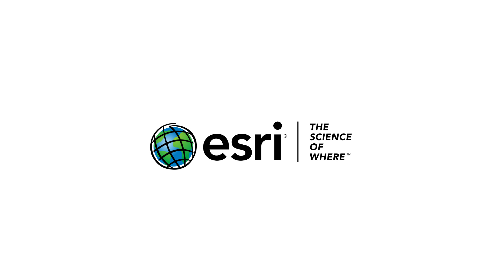

---
<!-- _class: lead invert-->

## twitter: [@rustcpp_cardiff](https://twitter.com/rustcpp_cardiff)
## email: [rustandcppcardiff@gmail.com](rustandcppcadiff@gmail.com)
## discord: [https://discord.gg/DGSpkYP](https://discord.gg/DGSpkYP)

---

<!-- _class: lead invert-->

# Objectives

Learn and share
Introduce new people
Challenge ourselves
Real world solutions
Advance our ability

---

---
<!-- _class: invert-->

# Conduct

- Privacy
- [Code of Conduct](https://www.rust-lang.org/policies/code-of-conduct)
  - Just be wonderful
- [Pacman rule](https://www.ericholscher.com/blog/2017/aug/2/pacman-rule-conferences/)

---

<!-- _class: lead invert-->

---
<!-- _class: lead default -->

# **Rust Nation 2023**

The UKs first Rust Conference

---

# Rust Nation

We all had an awesome time!

Met some folks we'd only ever seen online

---
<!-- _class: invert-->

# Alex's Takeaways

> - Thinking about Rust development in the long term
>   - Quality of life improvements for the language.
>   - Supply chain security.
> - Interoperability of Rust with other languages.
>   - Swapping out 'C' based systems for Rust.
>   - Working with new scripting languages designed for Rust specifically.
>   - Rust-Python interoperability for Machine Learning.

---
<!-- _class: invert-->

# Alex's Takeaways

> - Asynchronous Rust.
>   - A topic many people wanted to understand in greater depth.
> - Community growth and development
>   - How to introduce Rust to your company.
>   - How to learn and teach, aid the development of others.
>   - Building a community around friendly, open communication and shared learning.

---

# Chris' Takeaways

> There was a significant energy in the venue that was infectious. Each talk was rammed, people sat in aisles or standing in the wings

>Observations on inclusivity align well with the goals of the Rust Foundation that is evident in their key note speech; focus on community and contribution. Like most developers, I suffer from imposter syndrome and hearing some words of encouragement as given me impetuous to find a voice in the community (again).

---

# Chris' Takeaways

> Channels are the best thing since default move semantics

> Magnification on security

> Rust developers are mostly hip and trendy Web devs

> The rise of machines embedded systems

---
# My takeaways
<!-- _class: invert-->

- the Rust community is growing fast and looking for more enterprise engagement
- The developer background of rust developers is super broad - from Go developers from the DevOps world, to ReactNative engineers doing app development.
- lots of folks want to get into Rust - some part or wholly funded themselves to come to the conference
- Rust is being used in unexpected places (Nandos app!)
- Update your compiler version _always_

---

<!-- _class: lead -->

# What did you all think?

---

# Some specifics

---

<!-- _class: lead -->

### Dates coming up

**15th March** - Injecting Rust Hooks into a 1999 Game Binary (unsafe)
**29th March** - Writing your own rust 'book' with mdBook
**12th April** - Rust Atomics Book Club Launch

Call for speakers!

---

Everything else